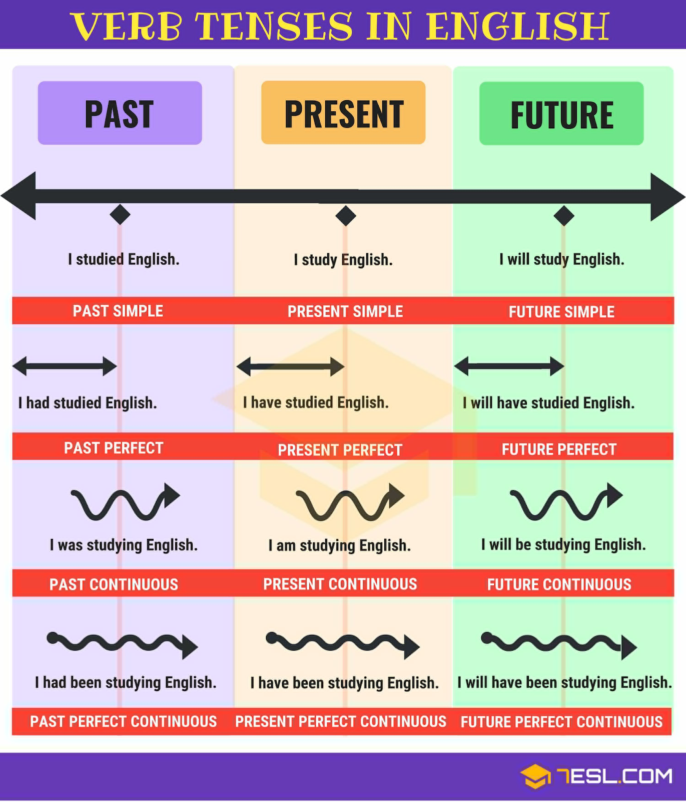

# Table of Contents
1. [Grammar](#grammar)
    - [Verb Tense](#verb-tense)
        - [Rules](#rules)
        - [Present Simple](#present-simple)
        - [Present Continuous](#present-continuous)
        - [Present Perfect](#present-perfect)
        - [Present Perfect Continuous](#present-perfect-continuous)
        - [Past Simple](#past-simple)
        - [Past Continuous](#past-continuous)
        - [Past Perfect](#past-perfect)
        - [Past Perfect Continuous](#past-perfect-continuous)
        - [Future Simples](#future-simples)
        - [Future Continuous](#future-continuous)
        - [Future Perfect](#future-perfect)
        - [Future Perfect Continuous](#future-perfect-continuous)
        - [Be going to](#be-going-to)
    - [Verbs Forms](#verbs-forms)
        - [Infinitive](#infinitive)
        - [Past](#past)
        - [Participle](#participle)
        - [Gerund](#gerund)
    - [Comparative vs Superlative](#comparative-vs-superlative)
    - [Conditionals](#conditionals)
    - [Others](#others)
        - [Questions](#questions)
        - [Passive Voice](#passive-voice)
        - [Phrasal Verbs](#phrasal-verbs)
        - [Reported/Indirect Speech](#reported/indirect-speech)
2. [Others](#others)
    - [Time Sequencers](#time-sequencers)
    - [Relative Clauses](#relative-clauses)
    - [Quantifiers](#quantifiers)
    - [Obligations/Advice](#obligations/advice)
    - [Possibility](#possibility)
    - [Adverbs](#adverbs)
    - [Article](#article)
    - [Prepositions](#prepositions)
    - [Possessive Adjectives](#possessive-adjectives)
    - [Pronouns](#pronouns)
    - [Expressing Movement](#expressing-movement)
3. [Key Words](#key-words)
    - [Some…, Any…, No… & Every…](#some…,-any…,-no…-&every…)
    - [used to / didn’t use to](#used-to-/-didn’t-use-to)
    - [So & Neither](#So-&-Neither)
    - [There is | are](#there-is-|-are)
    - [Make | Do](#make-|-do)
    - [What | Which](#what-|-which)
    - [Get](#get)
4. [Vocabulary](#vocabulary)

# Grammar
## Verb Tense
### Rules

|  | Past | Present | Future |
|---|---|---|---|
| Simple | verb in past OR did + verb | verb in infinitive | will + verb in infinitive |
| Perfect | to be in past + verb -ing | to be + verb -ing | will + be + verb -ing |
| Continuous | had + verb participle | have + verb participle | will + have + verb participle |
| Perfect Continuous | had + been + verb -ing | have + been + verb -ing | will + have + been + verb -ing |

### Present Simple ----------------------------------------------------------------------------------------
use for things you do every day/week/year or things which are generally true or always happen\
can use adverbs (before main verb and after be) and expressions (at the end of a sentence) of frequency\
`verbs in the infinitive`

**Ex:**\
&nbsp;&nbsp;I usually *work* at home.\
&nbsp;&nbsp;It *doesn’t* work.\
&nbsp;&nbsp;I'm never *ill*.

### Present Continuous ------------------------------------------------------------------------------------
use to things happening now or for temporary thing that are happening now or to describe a picture or for future arrangement (have fixed time or place set)\
`verb to be + verb with -ing`

**Ex:**\
&nbsp;&nbsp;You *are living* in NYC.\
&nbsp;&nbsp;He *is running* now.\
&nbsp;&nbsp;I *am seeing* a friend tonight.

### Present Perfect ---------------------------------------------------------------------------------------
use to talk about the recent past (not saying the exactly time) or to give news\
in (?) and (-) sentences, use *yet* to ask if something has happened or say if it hasn’t happened\
in (+) sentences, use to say that something happened very recently, use *already* to say something happened before now or earlier than expected\
in (+), (-) and (?) sentences, use just to say that something happened a short time ago\
use *for*/*since* to talk about action/states which started in the past and are still true; in (?) use ‘How long …?’ to ask about the duration of an action/state; use for for time period and since with the beginning of a time period\
`verb have + verb in past participle`

**Ex:**\
&nbsp;&nbsp;We *haven’t finished* the work --- She’s just *woken up*.\
&nbsp;&nbsp;It *has* **already** *started*. --- He *hasn’t arrived* **yet**.\
&nbsp;&nbsp;I’*ve worked* there since 2005. --- I’*ve lived* there for twenty years.

### Present Perfect Continuous -----------------------------------------------------------------------------
use when the action ended at a certain point in the past or that started in the past and still continues in the present\
`have + been + verb with -ing`

**Ex:**\
&nbsp;&nbsp;You *have been going* to school by car.

### Past Simple --------------------------------------------------------------------------------------------
use to talk about finished action in the past\
`main verb in simple past (for (?) and (-), verb in infinitive after did/didn’t)`

**Ex:**\
&nbsp;&nbsp;I *stayed* with friends.\
&nbsp;&nbsp;I *stopped* there yesterday.\
&nbsp;&nbsp;I *didn’t go* to the mall.

### Past Continuous -----------------------------------------------------------------------------------------
use to describe an action in progress at a specific moment in the past\
`verb to be in past (was/were) + verb with -ing`

**Ex:**\
&nbsp;&nbsp;I *was working*.\
&nbsp;&nbsp;You *were studying*.

### Past Perfect --------------------------------------------------------------------------------------------
use when you already talking about the past and want to talk about an earlier past action (one must precede the other)\
`had/hadn’t + verb in past participle`

**Ex:**\
&nbsp;&nbsp;I got home in time, the game *hadn’t started*.\
&nbsp;&nbsp;*Had* you *been* there before?

### Past Perfect Continuous --------------------------------------------------------------------------------
use when the action was in progress in the past before sth happen\
`had + been + verb with -ing`

**Ex:**\
&nbsp;&nbsp;You *had been going* to school by car.

### Future Simples -----------------------------------------------------------------------------------------
use to make predictions, decisions, offers or promises\
can use shall instead of will in questions\
`will/won’t + verb in infinitive`

**Ex:**\
&nbsp;&nbsp;I *won’t stay* for dinner.\
&nbsp;&nbsp;I *will help* you.

### Future Continuous ---------------------------------------------------------------------------------------
use to describe an action in progress at a specific moment in the future\
`will/won’t + be + verb with -ing`

**Ex:**\
&nbsp;&nbsp;You *won't be going* to school tomorrow.\
&nbsp;&nbsp;I *will be reading* Oz soon.

### Future Perfect -------------------------------------------------------------------------------------------
use to indicate that sth will be finished at a specific moment in the future\
can use the prepositions by and  in\
`will/won’t + have + verb in participle`

**Ex:**\
&nbsp;&nbsp;He *will have gone* to school by car in one hour.

### Future Perfect Continuous --------------------------------------------------------------------------------
use when the action already start and still happen in the future\
`will/won’t + have + been + verb with -ing`

**Ex:**\
&nbsp;&nbsp;You *will have been going* to school by car.

### Be going to ----------------------------------------------------------------------------------------------
use to talk about future plans or intentions or make a prediction\
is similar to present continuous (can use both)\
`verb to be + going to + verb in infinitive`

**Ex:**\
&nbsp;&nbsp;He is *going to work*.\
&nbsp;&nbsp;Are you *going to play* soccer?

## Verbs Forms
### Infinitive
#### With(out) To
often use infinitive with to, can be to be (+) or not to be (-)\
use as the subject or object of a sentence\
use after verb/prepositions\
with auxiliary and modal verbs use without to

**Ex:**\
&nbsp;&nbsp;I need *to buy* new clothes.\
&nbsp;&nbsp;I cannot make you *take* this medication.

#### for 3rd person singular
default -> add -s\
consonant+y -> add -ies\
after ch/ce/ge/sh -> add -es

### Past 
**Regular Verbs use -ed rule**\
default -> add -ed\
&nbsp;&nbsp;finish with ‘e’ -> add -d\
&nbsp;&nbsp;finish with ‘y’ after a consonant -> replace ‘y’ with -ied\
&nbsp;&nbsp;finish with CVC -> double last consonant and add -ed

**Irregular Verbs have unique form**

### Participle
Regular Verb use -ed rule (same as Simple Past)\
Irregular Verbs have other unique form

### Gerund
base form of the verb ing, can be + or -\
use as the subject or object of a sentence\
after verb or prepositions\
&nbsp;&nbsp;default -> add -ing\
&nbsp;&nbsp;finish with ‘e’ -> cut -e and add -in\
&nbsp;&nbsp;finish with ‘ie’ -> replace ‘ie’ with ‘y’ and add -ing\
&nbsp;&nbsp;mono/disyllabic finish with CVC* -> double last consonant and add -ing (if last consonant is ‘w’ or ‘x’ OR the stressed syllable is the first does not double)

&nbsp;&nbsp;&nbsp;&nbsp;*\* consonant-vowel-consonant*

## Comparative vs Superlative
### Comparative
use to compare two people, things, places or actions\
`comparative adj/adv + than`\
`as + adj/adv + as`

**Comparative Adjectives**\
&nbsp;&nbsp;1 syllable -> add -er &nbsp;&nbsp;**Ex:** *shorter*\
&nbsp;&nbsp;2+ syllable -> more/less + adj &nbsp;&nbsp;**Ex:** *more relaxed*\
&nbsp;&nbsp;consonant + y -> replace ‘y’ with -ier &nbsp;&nbsp;**Ex:** *busier*\
&nbsp;&nbsp;1 vowel + 1 cons -> double cons and add -er &nbsp;&nbsp;**Ex:** *bigger*\
&nbsp;&nbsp;there is irregulares &nbsp;&nbsp;**Ex:** *better*, *worse*, *further*

**Comparative Adverbs**\
regular -> more + adv &nbsp;&nbsp;**Ex:** *more older*\
there is irregulares &nbsp;&nbsp;**Ex:** *harder*, *better*, *worse*

**Ex:**\
&nbsp;&nbsp;My brother is *older than* me.\
&nbsp;&nbsp;He drives *as fast as* her.

### Superlative
use to compare one thing with your group\
after superlative we us\
`the + superlative adj/adv (usually use with ‘ever’)`

**Superlative Adjectives**\
&nbsp;&nbsp;1 syllable -> add -est &nbsp;&nbsp;**Ex:** *coldest*\
&nbsp;&nbsp;2+ syllable -> most + adj &nbsp;&nbsp;**Ex:** *most beautiful*\
&nbsp;&nbsp;consonant + y -> replace ‘y’ with -iest &nbsp;&nbsp;**Ex:** *prettiest*\
&nbsp;&nbsp;1 vowel + 1 cons -> double cons and add -est &nbsp;&nbsp;**Ex:** *hottest*\
&nbsp;&nbsp;there is irregulares &nbsp;&nbsp;**Ex:** *best*, *worst*, *furthest*

**Ex:**\
&nbsp;&nbsp;I have *the biggest* arm.\
&nbsp;&nbsp;He is *the best* player ever.

## Conditionals
### First Conditional
**if + present:** use to talk about a possible situation, and can use imperative or ‘can’ + infinitive\
&nbsp;&nbsp;`if + verb in present, will/won’t + verb in infinitive`\
**‘ll/won’t + verb:** use to talk about the consequence\
&nbsp;&nbsp;`will/won’t + verb in infinitive if + verb in present`

**Ex:**\
&nbsp;&nbsp;If I miss the bus, I’ll get a taxi.\
&nbsp;&nbsp;I’ll get the taxi if I miss the bus.

### Second Conditional
**if + past:** used to talk about an imaginary or hypothetical future situation, and can use  ‘If I were you …’\
`if + past, would/wouldn’t + verb in infinitive`\
**‘d/wouldn’t + verb:** use to talk about the consequence, and can use ‘could + verb’\
`would/wouldn’t + verb in infinitive if + past`

**Ex:**\
&nbsp;&nbsp;If a bull attacked me, I’d run away.\
&nbsp;&nbsp;If we went by car, we could stop.

## Others
### Questions
Question Words: Where, When and What\
**ASI** Auxiliary, Subject, Infinitive &nbsp;&nbsp;**Ex:** Where does your sister work?\
**QUASI** Question Word, Auxiliary, Subject, Infinitive &nbsp;&nbsp;**Ex:** Are you hungry?\
**QASI\*** Question Word, Subject, Infinitive &nbsp;&nbsp;**Ex:** Who painted Mr. Clark?\
*\* the question word need to be the subject of the verb*

### Passive Voice
invert the sentence, it’s unlike of active\
use when it isn’t known or important who does or did the action\
us ‘by’ to say who did\
`verb to be + verb in participle`

**Ex:**\
&nbsp;&nbsp;Tippex *is*n’t *used* very much today.\
&nbsp;&nbsp;The dishwasher *was invented* by Cochrane. *Passive Voice*\
&nbsp;&nbsp;Cochrane invented the dishwasher. *Active Voice*

### Phrasal Verbs
is the combination of two/three words to form a single semantic unit\
some doesn’t have an object, other has but some can separate others cannot\
when the object is a pronoun it always goes between the verb and particle\
`verb + particle (preposition or adverb)`

**Ex:**\
&nbsp;&nbsp;What time do you *get up*?\
&nbsp;&nbsp;*Turn* the TV *off*.

### Reported/Indirect Speech
use to report (tell someone) what another person said -- is always in the past\
often introduce with *said* (can’t use with an object and pronoun) or *tell* (must use with an object)

**Ex:**\
&nbsp;&nbsp;He said he loved me.\
&nbsp;&nbsp;He told me they would come.

# Others
## Time Sequencers
**WHEN:** use to join two action\
&nbsp;&nbsp;**Ex:** I was watching TV *when* the phone rang.\
**BECAUSE:** use to express a reason\
&nbsp;&nbsp;**Ex:** She was eating fast *because* she was in a hurry.\
**SO:** use to express a result\
&nbsp;&nbsp;**Ex:** She was in a hurry, *so* she was eating fast.\
**BUT:** use to show a contrast, in the middle of a sentence\
&nbsp;&nbsp;**Ex:** She tried to stop the car, *but* she hit the man.\
**ALTHOUGH:** use to show a contrast - beginning or middle of a sentence\
&nbsp;&nbsp;**Ex:** *Although* she tried to stop … - She tried to stop, *although* she …

## Relative Clauses
use to explain what a person, thing or place is or does\
**WHO:** use for person\
&nbsp;&nbsp;**Ex:** A cook is a person *who* makes food.\
**WHICH:** use for things\
&nbsp;&nbsp;**Ex:** Is that the book *which* everybody’s reading?\
**WHERE:** use for places\
&nbsp;&nbsp;**Ex:** A post office is a place *where* you can buy stamps.\
**THAT:** use for person and things\
&nbsp;&nbsp;**Ex:** A cook is a person *that* makes food. - Is that the book *that* everybody’s reading?

## Quantifiers
**Too**\
&nbsp;&nbsp;verb + too much\
&nbsp;&nbsp;too much + uncountable noun&nbsp;&nbsp;&nbsp;&nbsp;&nbsp;&nbsp;**Ex:** I have *too much work*.\
&nbsp;&nbsp;too many + countable noun&nbsp;&nbsp;&nbsp;&nbsp;&nbsp;&nbsp;**Ex:** I eat *too many cakes*.\
&nbsp;&nbsp;too + adjective&nbsp;&nbsp;&nbsp;&nbsp;&nbsp;&nbsp;**Ex:** I’m *too tired*.

**Enough**\
&nbsp;&nbsp;enough + noun *all that is necessary*&nbsp;&nbsp;&nbsp;&nbsp;&nbsp;&nbsp;**Ex:** I *drink enough* water.\
&nbsp;&nbsp;verb + enough *with no object*&nbsp;&nbsp;&nbsp;&nbsp;&nbsp;&nbsp;**Ex:** She doesn’t *sleep enough*.\
&nbsp;&nbsp;adj/adv + enough&nbsp;&nbsp;&nbsp;&nbsp;&nbsp;&nbsp;**Ex:** My fridge isn’t *big enough*.

## Obligations/Advice
`word + verb in infinitive`

**have to**\
use to talk about rules and obligations, normally a general one\
&nbsp;&nbsp;**Ex:** I *have to* get up at seven every day.

**don’t have to**\
use to say that there is no obligations, or it is not necessary\
use ‘do/does’ in ? and - sentences\
&nbsp;&nbsp;**Ex:** He does*n’t have to* work on Sunday - *Do* I *have to* buy a book?

**must**\
use to talk about rules and obligations, normally a personal one\
&nbsp;&nbsp;**Ex:** You *must* do your work tonight.

**mustn't**\
use to say something is prohibited\
&nbsp;&nbsp;**Ex:** She *mustn’t* leave her begs here.

**should/shouldn’t or ought to/ought not to**\
use to give somebody advice or say what you think is right to do\
often use ‘I think you should …’\
&nbsp;&nbsp;**Ex:** You *should* go home. - He *shouldn’t* work so hard. - *I think you should* leave.

## Possibility
use to say that perhaps you will/won’t do something\
`might/might not + verb in infinitive`\
`may/may not + verb in infinitive`\
&nbsp;&nbsp;**Ex:** We *might* have a picnic tomorrow. - I *might not* go to the party.

## Adverbs
**of Frequency**\
&nbsp;&nbsp;(100%) always >> usually/generally >> frequently >> often >> sometimes >> occasionally >> seldom >> rarely >> never (0%)

**of Place**\
used to describe a location, direction and distance\
&nbsp;&nbsp;Location: by the - in the - inside - here - nearby\
&nbsp;&nbsp;Direction: past the - to the end of the - into the - abroad\
&nbsp;&nbsp;Distance: from - away - off - apart

## Article
**The**\
used to identify a definite noun\
can use with singular and plural nouns\
&nbsp;&nbsp;**Ex:** The student is American.

**a - an**\
used before singular countable nouns\
*a* used before a consonant sound\
*an* used before vowel sounds\
&nbsp;&nbsp;**Ex:** I am a student. - This is an apple.

## Prepositions
**in**\
&nbsp;&nbsp;Places: countries, cities, rooms, buildings and closed space\
&nbsp;&nbsp;Time: month, season, years and times of day

**on**\
&nbsp;&nbsp;Places: transport and a surface\
&nbsp;&nbsp;Times: dates and days

**at**\
&nbsp;&nbsp;Places: places that you do something\
&nbsp;&nbsp;Times: time and festival periods

**Others**\
&nbsp;&nbsp;about - in front of - after - inside - against - instead of - before - near\
&nbsp;&nbsp;behind - outside - beside - since - besides - with - during - without - for

**Movement**\
&nbsp;&nbsp;to - along - from - through - into - across - out of - towards - on - over - off - under - up - around - downs - past

## Possessive Adjectives
expresses a sense of ownership\
use follow by a noun\
`my - your - his - her - its - our - their`\
&nbsp;&nbsp;**Ex:** It 's *my* book.

## Pronouns
**Possessive**\
use to talk about possession; use ‘Whose’ to ask about possession\
don’t use follow by with noun\
`mine - yours - his - hers - its - ours - theirs`\
&nbsp;&nbsp;**Ex:** It 's *mine*.

**Subject**\
indicate the subject of the action\
`I - you - he - she - it - we - they`\
&nbsp;&nbsp;**Ex:** *They* are beautiful. - *She* is amazing.

**Object**\
replaces nouns or noun phrases, avoids repetition\
`me - you - him - her - it - us - them`\
&nbsp;&nbsp;**Ex:** She gave *me* the keys. - There are a lot of books. I’m going to read *them*.

**Demonstrative**\
indicate which entities are being referred to and distinguish it\
This (singular) and These (plural) for objects in close proximity\
That (singular) and Those (plural) for objects at a distance\
&nbsp;&nbsp;**Ex:** *Those* shoes are mine! - Is *this* your card?

## Expressing Movement
to express some movement\
use a verb of movement and a preposition/adverb of movement\
into/out of with noun, in/out without noun\
&nbsp;&nbsp;**Ex:** The man went up the steps and into the church.

# Key Words
## Some…, Any…, No… & Every…
use when you don’t know exactly who (...body, …one), what (..thing) or where (...where)

**SOME..:** use with positive verb\
&nbsp;&nbsp;**Ex:** Let’s go *somewhere* tonight!\
**ANY…:** use with negative verb or question sentences\
&nbsp;&nbsp;**Ex:** Did *anybody* phone?\
**NO…:** in short answer or with positive verb (meaning is negative)\
&nbsp;&nbsp;**Ex:** There’s *nothing* in the fridge.\
**EVERY…:** use with positive/negative verb or question sentences\
&nbsp;&nbsp;**Ex:** I am seeing *everybody*.

## used to / didn’t use to
use to talk about thing that happened repeatedly or were true for a long time period in the past, but are usually not true now\
used to / didn’t use to + verb in infinitive\
&nbsp;&nbsp;**Ex:** My kid didn’t use to eat fruit, now he eats. - Did you used to work there?

## So & Neither
use to say you have something in common with somebody\
in (+) sentence use so\
in (-) sentence use neither\
`so/neither + auxiliar + I`\
&nbsp;&nbsp;**Ex:** So do I. - Neither am I.

## There is | are
used to say that somethings exists\
‘there is’ -> singular\
‘there are’ -> plural\
&nbsp;&nbsp;**Ex:** *There is* a book on the table. - *Are there* two dogs in that house?

## Make | Do
**make:** when we create or construct something\
&nbsp;&nbsp;a mistake/noise; an exam/exercise; homework/friends; lunch/plans

**do:** for other activities, general ones\
&nbsp;&nbsp;a course; a phone call; housework; sport/exercise

## What | Which
*what* is general\
*which* is always especifics

## Get
&nbsp;&nbsp;become + adjective/past participle&nbsp;&nbsp;&nbsp;&nbsp;**Ex:** get angry - get married\
&nbsp;&nbsp;become + comparative&nbsp;&nbsp;&nbsp;&nbsp;**Ex:** get better - get colder\
&nbsp;&nbsp;buy/obtain&nbsp;&nbsp;&nbsp;&nbsp;**Ex:** get a job - get a ticket\
&nbsp;&nbsp;with prepositions *phrasal verbs*&nbsp;&nbsp;&nbsp;&nbsp;**Ex:** get on/off a bus - get up\
&nbsp;&nbsp;receive&nbsp;&nbsp;&nbsp;&nbsp;**Ex:** get an email - get a text\
&nbsp;&nbsp;arrive&nbsp;&nbsp;&nbsp;&nbsp;**Ex:** get home - get to school

# Vocabulary